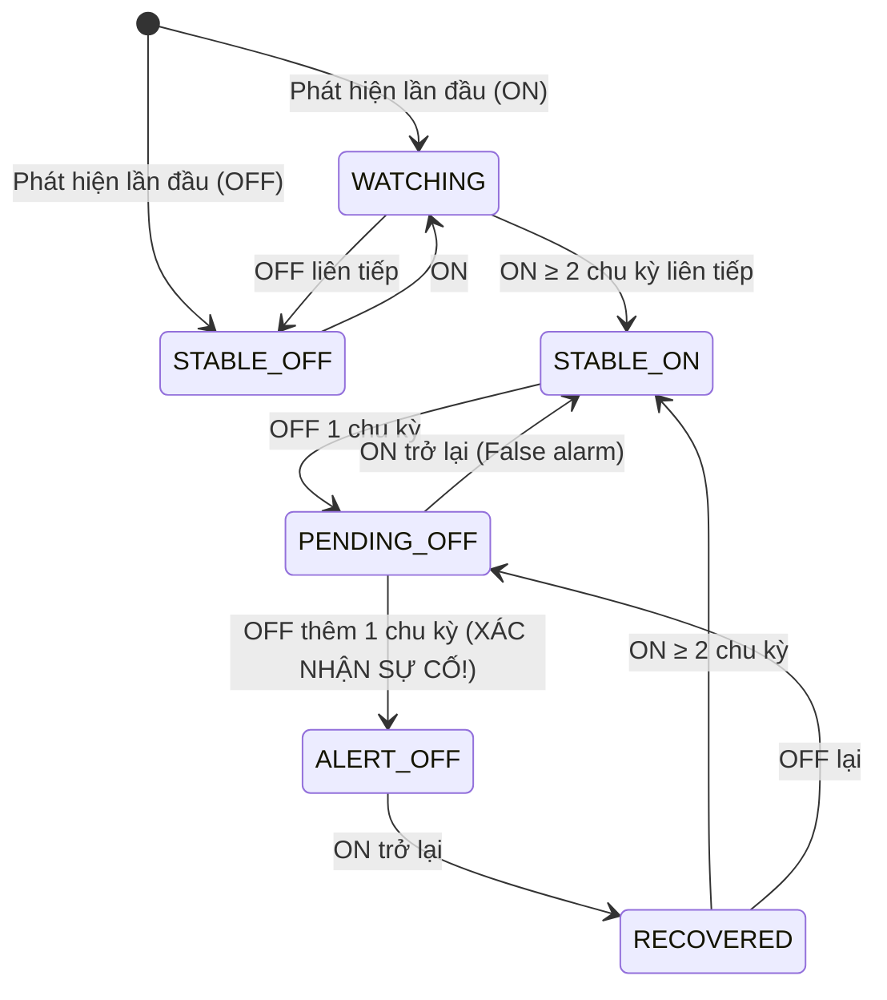
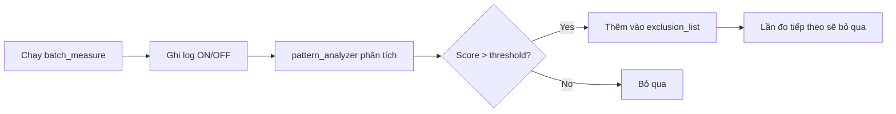
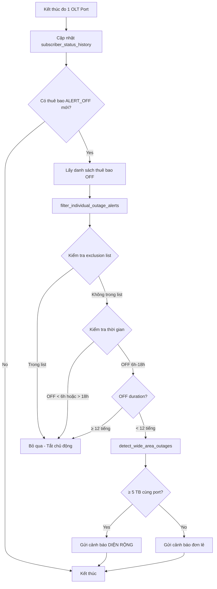

# Cơ chế Lọc và Gửi Cảnh báo Thuê bao DOWN Quang

## Tổng quan

Tài liệu này mô tả chi tiết cơ chế phát hiện, lọc và gửi cảnh báo thuê bao mất tín hiệu quang (DOWN). Hệ thống phân loại thuê bao thành **2 nhóm chính**:

| Nhóm | Mô tả | Hành động |
|------|-------|-----------|
| **Sự cố thực sự** | Thuê bao DOWN do sự cố kỹ thuật | Gửi cảnh báo để xử lý |
| **Tắt chủ động** | Thuê bao có thói quen tự tắt thiết bị | Loại khỏi cảnh báo |

---

## 1. Cơ chế State Machine - Phát hiện Sự cố

### 1.1 Các trạng thái của thuê bao



### 1.2 Quy trình xác nhận sự cố (2 chu kỳ)

```
Chu kỳ 1: STABLE_ON → [OFF] → PENDING_OFF (chờ xác nhận)
Chu kỳ 2: PENDING_OFF → [OFF] → ALERT_OFF (XÁC NHẬN SỰ CỐ!)
```

> [!IMPORTANT]
> Hệ thống yêu cầu **2 chu kỳ OFF liên tiếp** để xác nhận sự cố thực sự, giúp loại bỏ các trường hợp OFF tạm thời hoặc nhiễu tín hiệu.

---

## 2. Cơ chế Lọc Cảnh báo Đơn lẻ

### 2.1 Quy tắc lọc theo thời gian

Hàm `filter_individual_outage_alerts()` trong [notification.py](file:///home/vtst/do-kiem-chu-dong-pto/notification.py#L786-L874) áp dụng các quy tắc sau:

| Quy tắc | Điều kiện | Kết quả |
|---------|-----------|---------|
| **Rule 0** | Thuê bao trong `exclusion_list` | ❌ KHÔNG gửi |
| **Rule 1** | Bắt đầu OFF trước 6h sáng | ❌ KHÔNG gửi |
| **Rule 2** | Bắt đầu OFF sau 18h tối | ❌ KHÔNG gửi |
| **Rule 3** | Tổng thời gian OFF ≥ 12 tiếng | ❌ KHÔNG gửi |
| **Cho phép** | 6h ≤ off_start < 18h AND off_duration < 12h | ✅ GỬI |

### 2.2 Lý do lọc theo thời gian

- **Trước 6h sáng**: Người dùng có thể tự tắt thiết bị qua đêm
- **Sau 18h tối**: Người dùng có thể tắt thiết bị khi đi ngủ
- **OFF > 12 tiếng**: Có thể là thuê bao tạm ngừng sử dụng, không phải sự cố

---

## 3. Danh sách Loại trừ (Exclusion List)

### 3.1 Pattern Analyzer - Phân tích thói quen

Module [pattern_analyzer.py](file:///home/vtst/do-kiem-chu-dong-pto/pattern_analyzer.py) phân tích lịch sử ON/OFF để phát hiện thuê bao có thói quen tắt chủ động:

| Pattern Type | Điều kiện phát hiện | Threshold |
|--------------|---------------------|-----------|
| **NIGHT_OFF** | Tắt trong khoảng 20:00-06:00 | ≥ 50% events |
| **EVENING_OFF** | Tắt vào buổi tối | ≥ 30% events |
| **MULTI_DAILY** | Tắt/bật nhiều lần trong ngày | ≥ 2 ngày có ≥3 events |
| **CONSISTENT_HOUR** | Tắt vào giờ cố định | ≥ 60% events cùng giờ |
| **MIXED** | Kết hợp nhiều mẫu | Score > 0.5 |

### 3.2 Cấu trúc bảng `pattern_exclusion_list`

```sql
CREATE TABLE pattern_exclusion_list (
    id INTEGER PRIMARY KEY,
    ma_tb TEXT UNIQUE NOT NULL,      -- Mã thuê bao
    ten_tb TEXT,                      -- Tên thuê bao
    pattern_type TEXT,                -- Loại mẫu (NIGHT_OFF, MIXED...)
    total_events INTEGER,             -- Số sự kiện đã phát hiện
    pattern_score REAL,               -- Điểm mẫu (0-1)
    first_detected DATETIME,          -- Thời điểm phát hiện đầu
    last_updated DATETIME,            -- Cập nhật gần nhất
    is_active BOOLEAN DEFAULT 1,      -- Đang hoạt động?
    notes TEXT                        -- Ghi chú
);
```

### 3.3 Quy trình cập nhật Exclusion List



---

## 4. Phân loại Kết quả - 2 Bảng Hiển thị

### 4.1 Bảng 1: Thuê bao SỰ CỐ (Cần xử lý)

Thuê bao đáp ứng **TẤT CẢ** điều kiện:
- ✅ Trạng thái `ALERT_OFF` (đã xác nhận OFF 2 chu kỳ)
- ✅ **KHÔNG** nằm trong `exclusion_list`
- ✅ Thời điểm OFF từ 6h-18h
- ✅ Thời gian OFF < 12 tiếng

```sql
-- Query lấy thuê bao sự cố thực sự
SELECT h.* 
FROM subscriber_status_history h
WHERE h.current_state = 'ALERT_OFF'
  AND h.ma_tb NOT IN (
      SELECT ma_tb FROM pattern_exclusion_list WHERE is_active = 1
  )
  AND strftime('%H', h.first_off_time) BETWEEN '06' AND '17'
  AND (julianday('now') - julianday(h.first_off_time)) * 24 < 12
```

### 4.2 Bảng 2: Thuê bao TẮT CHỦ ĐỘNG (Loại trừ)

Thuê bao đáp ứng **ÍT NHẤT 1** điều kiện:
- ⚠️ Nằm trong `exclusion_list` (có thói quen tắt)
- ⚠️ Thời điểm OFF trước 6h sáng hoặc sau 18h
- ⚠️ Thời gian OFF ≥ 12 tiếng

```sql
-- Query lấy thuê bao tắt chủ động (trong exclusion list)
SELECT e.ma_tb, e.ten_tb, e.pattern_type, e.pattern_score,
       e.total_events, e.first_detected, e.last_updated
FROM pattern_exclusion_list e
WHERE e.is_active = 1
ORDER BY e.pattern_score DESC
```

---

## 5. Luồng xử lý Cảnh báo



---

## 6. Các hàm chính liên quan

| Hàm | File | Mục đích |
|-----|------|----------|
| `update_subscriber_status()` | subscriber_history.py | Cập nhật state machine |
| `get_current_off_subscribers()` | subscriber_history.py | Lấy tất cả TB đang OFF |
| `filter_individual_outage_alerts()` | notification.py | Lọc theo thời gian + exclusion |
| `detect_wide_area_outages()` | notification.py | Phát hiện sự cố diện rộng |
| `analyze_subscriber_patterns()` | pattern_analyzer.py | Phân tích thói quen ON/OFF |
| `update_exclusion_table()` | pattern_analyzer.py | Cập nhật exclusion list |
| `get_exclusion_list()` | subscriber_history.py | Lấy danh sách loại trừ |

---

## 7. Ví dụ minh họa

### 7.1 Thuê bao sự cố thực sự
```
Mã TB: PTOQOI001234
Thời điểm OFF: 09:30 (trong giờ hành chính)
Thời gian OFF: 2 tiếng
Exclusion list: KHÔNG
→ ✅ GỬI CẢNH BÁO
```

### 7.2 Thuê bao tắt chủ động
```
Mã TB: PTOSTY005678
Thời điểm OFF: 22:00 (buổi tối)
Pattern: NIGHT_OFF (score: 0.75)
Exclusion list: CÓ
→ ❌ KHÔNG GỬI (tắt theo thói quen đêm)
```

---

## 8. Tham khảo

- [Hướng dẫn trang quangchudong](file:///home/vtst/do-kiem-chu-dong-pto/docs/huong_dan_trang_quangchudong.md) - Tích hợp trang giám sát
- [subscriber_history.py](file:///home/vtst/do-kiem-chu-dong-pto/subscriber_history.py) - Module quản lý lịch sử trạng thái
- [notification.py](file:///home/vtst/do-kiem-chu-dong-pto/notification.py) - Module gửi cảnh báo
- [pattern_analyzer.py](file:///home/vtst/do-kiem-chu-dong-pto/pattern_analyzer.py) - Module phân tích mẫu ON/OFF
